# SLC Application Entity-Relationship Diagram

Generated from legacy-database-schema.md (31 tables, 61 indexes)

## ER Diagram

```mermaid
erDiagram
    CONFIGOPTIONMASTER ||--o{ SITECONFIGOPTION : "defines"
    OPERATOR ||--o{ OPERATORAPPFUNCTION : "has"
    APPFUNCTION ||--o{ OPERATORAPPFUNCTION : "assigned_to"
    PRODUCT ||--o{ MODIFY : "has_runtime_mods"
    PRODUCT ||--o{ GOALS : "creates"
    PRODUCT ||--o{ SERIAL : "produces"
    PRODUCT ||--o{ ITEMSERIAL : "produces"
    PRODUCT ||--o{ TOTALS : "accumulates"
    PRODUCT ||--o{ MFGORD : "ordered_as"
    PRODUCT ||--o{ PRODUCTPROCESS : "uses"
    ITEM ||--o{ ITEMMODIFY : "has_runtime_mods"
    ITEM ||--o{ ITEMSERIAL : "tracked_in"
    VALIDPROCESS ||--o{ PRODUCTPROCESS : "defines"
    OPERATOR ||--o{ SERIAL : "validates"
    OPERATOR ||--o{ ITEMSERIAL : "validates"
    GOALS ||--o{ SERIAL : "measures"
    GOALS ||--o{ ITEMSERIAL : "measures"
    SERIAL ||--o{ PALLETDTL : "packed_into"
    ITEMSERIAL ||--o{ PALLETDTL : "packed_into"
    PALLETHDR ||--o{ PALLETDTL : "contains"
    SERIAL ||--o{ BATCHORDER : "batched_as"
    COMMSYSID ||--o{ COMMHDR : "routes"
    COMMHDR ||--o{ COMMDTL : "details"
    MSG ||--o{ OPERATOR : "language_messages"
    DEVICE ||--o{ PRODUCTPROCESS : "optional_device"
    CROSSREF ||--o{ PRODUCT : "config_storage"
    DATECODE ||--o{ PRODUCT : "date_tracking"
    UBHEADER ||--o{ UBDETAIL : "contains"
    LOCALS ||--o{ PRODUCT : "display_area"

    CONFIGOPTIONMASTER {
        string OptionName PK
        string OptionDescr
        string OptionValue
        string AcceptableValues
        string OperatorEdits
    }

    SITECONFIGOPTION {
        string OptionName PK
        string OptionValue
    }

    OPERATOR {
        string Operator PK
        string Password
        string FirstName
        string LastName
        string LangCode
    }

    APPFUNCTION {
        string ID PK
        string Description
    }

    OPERATORAPPFUNCTION {
        string Operator FK
        string ID FK
        boolean Permitted
    }

    PRODUCT {
        int ProductCode PK
        string Desc1
        string Desc2
        string ShortDesc1
        string ShortDesc2
        string ShortDesc3
        decimal StdWgt
        string PackType
        decimal MinWgt
        decimal MaxWgt
    }

    ITEM {
        int ItemCode PK
        string Desc1
        string Desc2
        decimal StdWgt
        string PackType
        decimal MinWgt
        decimal MaxWgt
    }

    MODIFY {
        int ProductCode PK
        int TareToUse
        int PackDateOffset
        int KillDateOffset
        decimal Price
    }

    ITEMMODIFY {
        int ItemCode PK
        int TareToUse
        int PackDateOffset
        int KillDateOffset
        decimal Price
    }

    VALIDPROCESS {
        string ProcessID PK
        string Description
        string DefaultProcess
    }

    PRODUCTPROCESS {
        int ProductCode PK
        int ProcessSequence PK
        string ProcessID FK
        string GroupID
        string Device FK
    }

    GOALS {
        int GoalID PK
        int ProdCode FK
        string LimitBy
        decimal TargetLevel
        string OrdNum
        date TgtCompDate
        string GoalStatus
        decimal AllScaleTotalCount
    }

    SERIAL {
        string SerialNum PK
        char AddOrDel PK
        int ProductCode FK
        int ScaleNumber
        int Shift
        date PrintDate
        date PackDate
        date KillDate
        string Operator FK
        decimal LabelWgt
        decimal NetWgt
        int GoalID FK
        string PalletNum FK
    }

    ITEMSERIAL {
        string SerialNum PK
        char AddOrDel PK
        int ItemCode FK
        int ProductCode FK
        int ScaleNumber
        int Shift
        date PrintDate
        date PackDate
        date KillDate
        string Operator FK
        decimal LabelWgt
        decimal NetWgt
        int GoalID FK
        string CaseSerialNum FK
    }

    TOTALS {
        int ProductCode FK
        int Scale
        int Shift
        date PdnDate
        int LocalCount
        decimal LocalLabelWgt
        decimal LocalNetWgt
    }

    MFGORD {
        int64 MfgOrdNum PK
        date MfgOrdDate PK
        int ProdCode FK
        string MfgOrdStatus
    }

    BATCHORDER {
        int64 BatchID
        date BatchDate PK
        string OrdNum
        int ProdCode FK
    }

    PALLETHDR {
        string PalletNum PK
        int CaseCount
        boolean Complete
        date DateComplete
    }

    PALLETDTL {
        string PalletNum PK
        string SerialNum FK
        int ProductCode FK
        decimal LabelWgt
        decimal NetWgt
    }

    COMMHDR {
        int CommSeqID PK
        date DateRead
        date DateSent
        boolean Deleted
        int Priority
        string SendTo
        string SentFrom
        string Subject
        boolean WasRead
    }

    COMMDTL {
        int CommSeqID PK
        int DetailNumber PK
        string Body
    }

    COMMSYSID {
        string CommSysID PK
    }

    MAILID {
        string EmployeeName PK
        string EmployeeID PK
        string EMailID
        string CommSysID FK
    }

    DEVICE {
        string DeviceID PK
        int ComPort
        string NetworkID
        string IPAddress
        string Model
    }

    CROSSREF {
        string Application
        string ID
        string Descr
    }

    DATECODE {
        date Date PK
        string Code
    }

    MSG {
        string LangCode
        string MsgId
        string Msg
    }

    UBHEADER {
        string UBName PK
        int UBLength
        date UBAddDate
    }

    UBDETAIL {
        string UBName PK
        int UBDispLoc PK
        string UBField
        int UBLength
    }

    UBEXAMPLES {
        string UBField PK
        string UBExample
    }

    LOCALS {
        int LocalCode
        int PageNbr
        int ProductCode FK
        string pageheader
    }

    ERRMSGS {
        int ReturnCode PK
        string ErrorText
    }
```

## Major Components

### Product Management

- **PRODUCT** - Product definitions with weights, pack types, descriptions
- **ITEM** - Individual item codes with weight and packaging specifications
- **MODIFY** / **ITEMMODIFY** - Runtime configuration overrides by product/item
- **PRODUCTPROCESS** - Many-to-many relationship between products and valid processes
- **VALIDPROCESS** - Available manufacturing processes

### Manufacturing & Orders

- **GOALS** - Production goals/targets with target counts, dates, and status
- **MFGORD** - Manufacturing orders linked to products
- **BATCHORDER** - Batch tracking for orders

### Serialization & Tracking

- **SERIAL** - Individual box/case tracking with print date, kill date, weights, operators
- **ITEMSERIAL** - Item-level serialization (similar to SERIAL but for items)
- Both track: PrintDate, PackDate, KillDate, LabelWgt, NetWgt, GoalID

### Pallet Management

- **PALLETHDR** - Pallet header with case count and completion status
- **PALLETDTL** - Detail records of serial numbers packed on each pallet

### Production Totals

- **TOTALS** - Aggregated production metrics by ProductCode, Scale, Shift, and PdnDate
- Tracks: LocalCount, LocalLabelWgt, LocalNetWgt, and cancellation counts

### Configuration System

- **CONFIGOPTIONMASTER** - Master definition of 118 system configuration options
- **SITECONFIGOPTION** - Active configuration settings at runtime
- **CROSSREF** - Flexible key-value lookup table for dynamic configurations

### Access Control

- **OPERATOR** - User accounts with login credentials and language preference
- **APPFUNCTION** - Application menu functions and permissions
- **OPERATORAPPFUNCTION** - Junction table mapping operators to allowed functions

### Communications

- **COMMHDR** / **COMMDTL** - Message routing system (header/detail pattern)
- **MAILID** - Email address mappings for operators
- **MSG** - Multi-language message text storage

### Hardware & Display

- **DEVICE** - Serial/network device definitions (scales, printers, etc.)
- **UBHEADER** / **UBDETAIL** / **UBEXAMPLES** - User barcode format definitions
- **LOCALS** - Display area/page configuration by product
- **DATECODE** - Date code formatting rules

### System

- **ERRMSGS** - Error message codes and text

## Relationship Summary

**One-to-Many (1:N):**

- Serial numbers are created from Goals (Goals produce multiple Serials)
- Products have multiple serializations (SERIAL, ITEMSERIAL)
- Pallets contain multiple detail records
- Pallet details contain multiple serialized items
- Messages are detailed from headers

**Many-to-Many (M:N):**

- Products use multiple Processes (PRODUCTPROCESS)
- Operators have multiple Permissions (OPERATORAPPFUNCTION)

**Configuration Relationships:**

- ConfigOptionMaster defines available options
- SiteConfigOption stores active values
- CrossRef provides flexible alternate storage
