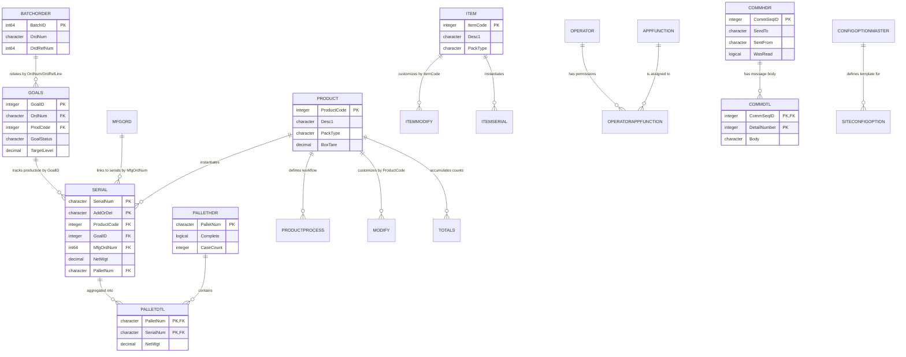

Generated from [[0.Legacy Database Schema]]  on 2026-03-09

```mermaid
erDiagram
    %% Production & Ordering
    BATCHORDER ||--o{ GOALS : "relates by OrdNum/OrdRefLine"
    GOALS ||--o{ SERIAL : "tracks production by GoalID"
    MFGORD ||--o{ SERIAL : "links to serials by MfgOrdNum"
    SERIAL ||--o{ PALLETDTL : "aggregated into"
    PALLETHDR ||--o{ PALLETDTL : "contains"
    
    %% Product & Item Definitions
    PRODUCT ||--o{ PRODUCTPROCESS : "defines workflow"
    PRODUCT ||--o{ MODIFY : "customizes by ProductCode"
    PRODUCT ||--o{ TOTALS : "accumulates counts"
    PRODUCT ||--o{ SERIAL : "instantiates"
    ITEM ||--o{ ITEMMODIFY : "customizes by ItemCode"
    ITEM ||--o{ ITEMSERIAL : "instantiates"
    
    %% System & Security
    OPERATOR ||--o{ OPERATORAPPFUNCTION : "has permissions"
    APPFUNCTION ||--o{ OPERATORAPPFUNCTION : "is assigned to"
    COMMHDR ||--o{ COMMDTL : "has message body"
    CONFIGOPTIONMASTER ||--o{ SITECONFIGOPTION : "defines template for"

    PRODUCT {
        integer ProductCode PK
        character Desc1
        character PackType
        decimal BoxTare
    }

    SERIAL {
        character SerialNum PK
        character AddOrDel PK
        integer ProductCode FK
        integer GoalID FK
        int64 MfgOrdNum FK
        decimal NetWgt
        character PalletNum FK
    }

    GOALS {
        integer GoalID PK
        character OrdNum FK
        integer ProdCode FK
        character GoalStatus
        decimal TargetLevel
    }

    BATCHORDER {
        int64 BatchID PK
        character OrdNum
        int64 OrdRefNum
    }

    PALLETHDR {
        character PalletNum PK
        logical Complete
        integer CaseCount
    }

    PALLETDTL {
        character PalletNum PK, FK
        character SerialNum PK, FK
        decimal NetWgt
    }

    ITEM {
        integer ItemCode PK
        character Desc1
        character PackType
    }

    COMMHDR {
        integer CommSeqID PK
        character SendTo
        character SentFrom
        logical WasRead
    }

    COMMDTL {
        integer CommSeqID PK, FK
        integer DetailNumber PK
        character Body
    }
```