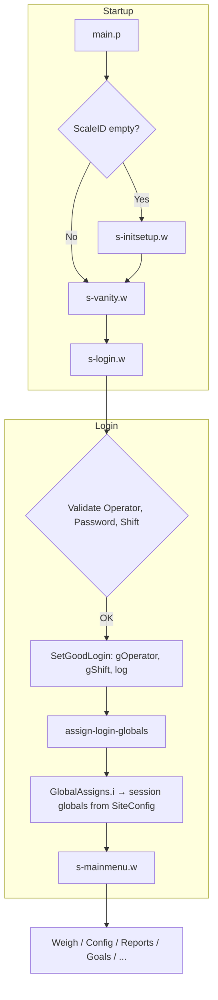
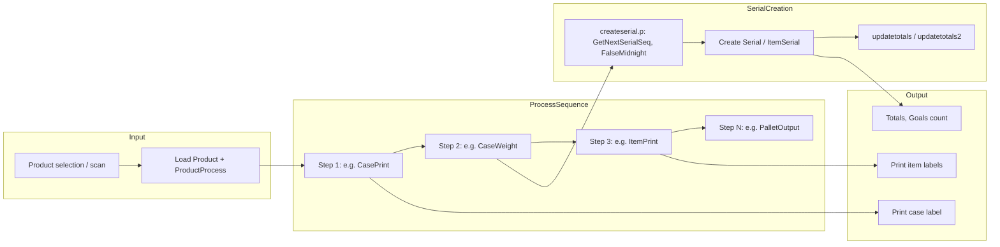
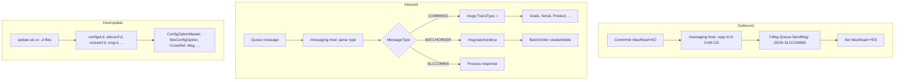
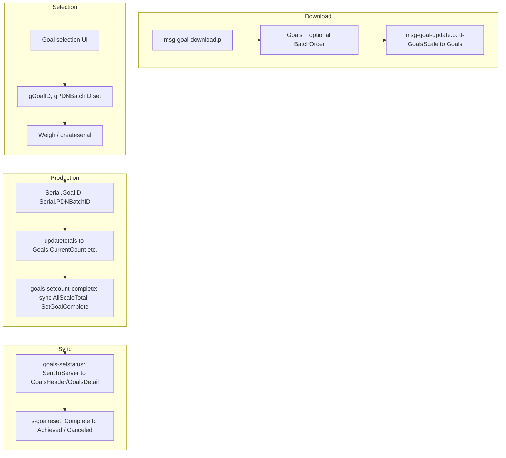
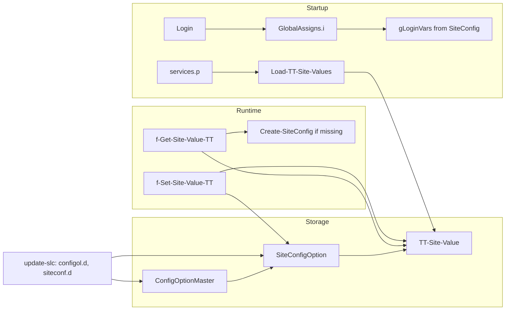
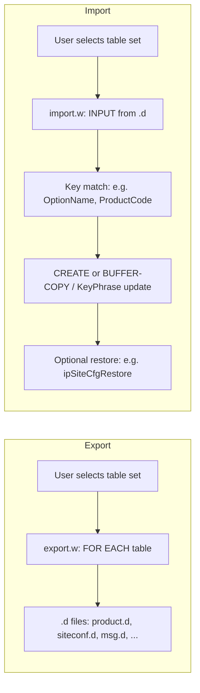
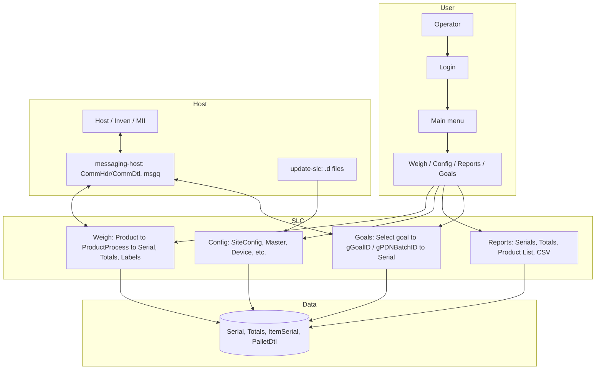

# SLC Application Data Flows — Words and Pictures

This document diagrams the main data flows in the SLC (Scale Labeling Station) application: startup/session, production (weigh), host/communications, goals, configuration, and system import/export.

---

## 1. Application Startup & Session Flow

**In words:** Startup runs from `main.p`: it runs `ip-Check-ScaleID` (if ScaleID is empty, it runs s-initsetup so the scale is configured), then enters a loop that runs s-vanity (splash screen). From vanity, the user launches s-login. Login validates operator, password, and shift (VALIDSHIFTS); on success it runs SetGoodLogin (sets gOperator, gShift, writes to log) and assign-login-globals, which runs GlobalAssigns.i and sets gLangCode. Session globals (from gLoginVars.i) are populated from SiteConfigOption. Control returns to main, which runs s-mainmenu; from there the operator can open Weigh, Config, Reports, Goals, etc.



---

## 2. Production (Weigh) Flow — One Case

**In words:** The operator selects or scans a product; the app loads Product and the ProductProcess sequence (by ProcessSequence). For each step (e.g. case print, weigh, item print, pallet output), the corresponding routine runs (e.g. case-print, scale read, createserial). Serial creation: GetNextSerialSeq, FalseMidnight (PackDate/KillDate), CreateSerial (Serial and optionally ItemSerial), UserBarString/NVPs, GoalID/PDNBatchID; then updatetotals. Labels are built from Modify, Product, and Serial/ItemSerial and printed via lib/printlabel.p (or external Label Engine).



**ProductProcess-driven flow (from Data Models):**

```
┌─────────────────────────────────────────────────────────────┐
│                   PRODUCT SELECTION                           │
│                  (User scans barcode)                         │
└──────────────────────┬──────────────────────────────────────┘
                        │
                        ▼
         ┌─────────────────────────────-┐
         │  Load Product Record         │
         │  ProductCode = 1001          │
         └──────────────┬───────────────┘
                        │
                        ▼
        ┌────────────────────────────────┐
        │ Query ProductProcess WHERE     │
        │ ProductCode = 1001             │
        │ ORDER BY ProcessSequence       │
        └──────────┬─────────────────────┘
                   │
         ┌─────────┴──────────┬──────────────┬─────────────┐
         │                    │              │             │
         ▼                    ▼              ▼             ▼
      Step1             Step2          Step3          Step4
    ProcessID=       ProcessID=     ProcessID=    ProcessID=
    CasePrint      CaseWeight      ItemPrint    PalletOutput
    Device=        Device=         Device=      Device=None
    Printer1       Scale1          Printer2
         │              │              │            │
         ▼              ▼              ▼            ▼
    Print Label   Read Scale    Print Items   Format Pallet
    Printer1      Scale1        Printer2      (no device)
         │              │              │            │
         ▼              ▼              ▼            ▼
    Serial.Descr  Serial.Wgt     ItemSerial   PalletHdr
    Updated       Updated       Created      Updated
         │              │              │            │
         └──────────────┴──────────────┴────────────┘
                        │
                        ▼
              ┌──────────────────────┐
              │  Sequence Complete    │
              │  Case ready to ship   │
              └──────────────────────┘
```

---

## 3. Host / Communications Flow

**In words:** Outbound: Records to send are CommHdr with WasRead = NO; messaging-host copies them (and CommDtl) to temp, sends JSON (e.g. SLCCOMMS) to the message queue, then sets WasRead = YES. Inbound: Host sends (e.g. COMMMSG, BATCHORDER); messaging-host parses body and dispatches by type (COMMMSG → msgq&lt;TransType&gt;.r, BATCHORDER → msg-batchorder.p, etc.). Those handlers create/update SLC tables (Goals, BatchOrder, Operator, Product, etc.). update-slc.w imports .d files (config, crossref, msg, etc.) into ConfigOptionMaster, SiteConfigOption, CrossRef, Msg, etc.



---

## 4. Goals Flow

**In words:** Goals are created/updated by the host (msg-goal-download.p, msg-goal-update.p) and optionally by batch (BatchOrder from goal Description "Batch:*"). Operator selects a goal (batch or fresh); gGoalID and gPDNBatchID are set. When a serial is created, createserial assigns Serial.GoalID and Serial.PDNBatchID from those globals. goals-setstatus sends status to Production when SentToServer = NO; goals-setcomplete and goals-setcount-complete sync totals and set Complete when target is met. s-goalreset moves Complete → Achieved (or to Canceled) with supervisor check.



---

## 5. Configuration Flow

**In words:** ConfigOptionMaster defines options (OptionName, AcceptableValues, OperatorEdits); SiteConfigOption holds the current value per site. At startup, services.p runs Load-TT-Site-Values so TT-Site-Value is filled from SiteConfigOption (and registry for some keys). Code reads via f-Get-Site-Value-TT (cache + optional Create-SiteConfig); writes via f-Set-Site-Value-TT (UpdateSiteConfig = YES updates both TT and SiteConfigOption). At login, GlobalAssigns.i reads many options and sets gLoginVars. Host can push config via update-slc (configol.d, siteconf.d).



---

## 6. System Import/Export Flow

**In words:** User selects a table or group (e.g. "Products", "Site Configs", "Message") in system/export.w or import.w. Export writes DB rows to .d files (e.g. product.d, siteconf.d, msg.d). Import reads .d files, matches by key (e.g. ProductCode, OptionName, LangCode+MsgId), and create-or-updates DB rows. Some imports have extra logic (e.g. Site Config ipSiteCfgRestore for Uniquenum/ScaleID/PlantID; Config Master keeps PlantID).



---

## 7. High-Level "All Flows" Overview



---

## Summary Table

| Flow | Trigger | Main data | Key procedures / components |
|------|--------|-----------|-----------------------------|
| **Startup / session** | main.p run | ScaleID, Operator, session globals | ip-Check-ScaleID, s-vanity, s-login, SetGoodLogin, GlobalAssigns.i |
| **Production (weigh)** | Product selection, process steps | Product, ProductProcess, Serial, Totals, Modify | weigh.w, createserial.p, FalseMidnight, updatetotals, printlabel.p |
| **Host / comms** | Queue messages, update package | CommHdr, CommDtl, Goals, BatchOrder, config tables | messaging-host.w, msgq*.r, msg-batchorder.p, update-slc.w |
| **Goals** | Host download, operator selection, production | Goals, BatchOrder, Serial.GoalID/PDNBatchID | msg-goal-download/update, goals-setstatus/setcomplete/setcount-complete, s-goalreset |
| **Configuration** | Startup, login, host update, UI edit | ConfigOptionMaster, SiteConfigOption, TT-Site-Value | Load-TT-Site-Values, f-Get/Set-Site-Value-TT, GlobalAssigns.i, create-sitecfg.p |
| **Import/export** | User choice in system menu | .d files, all exportable tables | system/export.w, system/import.w, ipSiteCfgRestore, KeyPhrase |

---

